# 🛡️ Agentic Honey-Pot API

Production-grade scam detection and intelligence extraction system for the **India AI Impact Buildathon**.

## 🎯 Overview

A multi-agent system that detects scam intent, maintains persona-driven conversations in Hinglish, and silently extracts intelligence for law enforcement. Built with LangGraph for state orchestration and powered by Claude 3.5 Sonnet for human-like responses.

## 🏗️ Architecture

```mermaid
graph TD
    A[Mock Scammer API] -->|POST /api/honeypot| B[FastAPI Layer]
    B --> C{API Key Valid?}
    C -->|No| D[401 Unauthorized]
    C -->|Yes| E[LangGraph State Machine]
    
    E --> F[START: Load/Initialize Session]
    F --> G[DETECT: Profiler Agent]
    
    G --> H{Scam Probability?}
    H -->|< 70%| I[Generic Response]
    H -->|≥ 70%| J[ENGAGE: Actor Agent]
    
    J --> K[EXTRACT: Auditor Agent]
    K --> L[Save to Redis]
    
    L --> M{Max Turns?}
    M -->|No| N[Return Response]
    M -->|Yes| O[CALLBACK: GUVI Endpoint]
    
    O --> P[Self-Healing Retry]
    P -->|Success| N
    P -->|Failure| Q[Local Fallback Storage]
    
    style G fill:#ff9999
    style J fill:#99ccff
    style K fill:#99ff99
    style O fill:#ffcc99
```



## 📁 Project Structure

```
astral-constellation/
├── config.py              # Centralized configuration
├── main.py                # FastAPI application
├── graph.py               # LangGraph state machine
├── models/
│   ├── schemas.py        # API request/response models
│   └── state.py          # LangGraph state definition
├── agents/
│   ├── profiler.py       # 🔍 Agent 1: Zero-trust validation
│   ├── actor.py          # 🎭 Agent 2: Persona responses
│   └── auditor.py        # 🕵️ Agent 3: Silent extraction
├── utils/
│   ├── logger.py         # National Security grade logging
│   ├── redis_client.py   # Session state manager
│   ├── forensics.py      # Domain age & TRAI validation
│   └── extraction.py     # Intelligence extraction patterns
├── services/
│   └── callback.py       # GUVI callback with retry
└── tests/
    ├── mock_scammer.py   # Scam message simulator
    └── test_workflow.py  # End-to-end tests
```

## 🚀 Quick Start

### Prerequisites

- Python 3.11+
- Redis (via Docker or local installation)
- API Keys:
  - Google AI (Gemini)
  - Anthropic (Claude 3.5 Sonnet)
  - GUVI Hackathon callback endpoint

### Installation

```bash
# 1. Clone or navigate to project
cd astral-constellation

# 2. Create virtual environment
python -m venv venv
.\venv\Scripts\activate  # Windows
# source venv/bin/activate  # Linux/Mac

# 3. Install dependencies
pip install -r requirements.txt

# 4. Set up environment variables
copy .env.example .env
# Edit .env with your API keys

# 5. Start Redis
docker-compose up -d

# 6. Run the API
python main.py
```

The API will be available at `http://localhost:8000`

## 🔑 Environment Configuration

Edit `.env` with your credentials:

```env
# Required API Keys
GOOGLE_API_KEY=your_google_ai_api_key_here
ANTHROPIC_API_KEY=your_anthropic_api_key_here

# GUVI Hackathon
GUVI_CALLBACK_URL=https://your-callback-endpoint.com/updateHoneyPotFinalResult
GUVI_API_KEY=your_guvi_api_key_here

# API Security
API_KEY=your_secret_api_key_change_this

# Redis Configuration (defaults work with docker-compose)
REDIS_HOST=localhost
REDIS_PORT=6379
```

## 📡 API Endpoints

### Main Honey-Pot Endpoint

```http
POST /api/honeypot
Headers:
  X-API-Key: your_api_key
  Content-Type: application/json

Body:
{
  "session_id": "unique-session-id",
  "sender_id": "9876543210",
  "message": "Your account is blocked. Click here to verify.",
  "timestamp": "2026-02-06T10:00:00Z"
}

Response:
{
  "session_id": "unique-session-id",
  "response": "Arre beta, ye kya ho gaya? Mera account blocked?",
  "engagement_duration": 1.234,
  "turn_number": 1,
  "is_complete": false
}
```

### Health Check

```http
GET /health

Response:
{
  "status": "healthy",
  "timestamp": "2026-02-06T10:00:00Z",
  "redis_connected": true,
  "version": "1.0.0"
}
```

### Session Management (Debug)

```http
GET /api/session/{session_id}
Headers:
  X-API-Key: your_api_key

DELETE /api/session/{session_id}
Headers:
  X-API-Key: your_api_key
```

## 🎭 Agent Details

### 🔍 Agent 1: The Profiler

Zero-trust scam detection:
- TRAI header validation
- Domain age verification via WHOIS
- URL safety analysis
- Scam probability scoring (0.0-1.0)

**Engagement threshold**: Only responds if scam probability ≥ 0.7

### 🎭 Agent 2: The Actor

Hinglish persona engine powered by Claude 3.5 Sonnet:

**Confused Senior Persona**:
- Elderly person unclear about technology
- Emotional progression: Confused → Scared → Curious → Extracting
- Example: *"Arre beta, ye OTP kya hota hai? Mujhe dar lag raha hai..."*

**Eager Student Persona**:
- Young person excited about opportunities
- Shows interest but asks verification questions
- Example: *"Wow free iPhone? Theek hai bhai, but pehle tumhara number do na?"*

### 🕵️ Agent 3: The Auditor

Silent intelligence extraction:
- **UPI IDs**: `scammer@paytm`
- **Bank Accounts**: 9-18 digit numbers
- **Phone Numbers**: Indian/international formats
- **URLs**: Including suspicious TLDs (.tk, .ml, .xyz)
- **Emails**: All email addresses
- **Keywords**: Urgency, verification, rewards

All findings stored in "Internal Forensic Ledger" with timestamps.

## 🧪 Testing

### Run Unit Tests

```bash
pytest tests/ -v --cov=.
```

### Manual Testing with Mock Scammer

```bash
# Generate sample scam messages
python tests/mock_scammer.py

# Run interactive test
curl -X POST http://localhost:8000/api/honeypot \
  -H "X-API-Key: your_api_key" \
  -H "Content-Type: application/json" \
  -d '{
    "session_id": "test-123",
    "sender_id": "SCAM99",
    "message": "URGENT! Account blocked. Verify: https://fake-bank.tk"
  }'
```

## 📊 Demo Scenarios

### Scenario 1: Bank Account Scam

1. Scammer sends: *"Your HDFC account suspended. Verify: https://secure-verify.tk"*
2. Profiler detects: High scam probability (domain age < 30 days, suspicious TLD)
3. Actor responds: *"Arre ye kya ho gaya? Mera account suspended? Main kya karu?"*
4. Auditor extracts: URL, domain age, keywords
5. Continue for 15 turns or until high-value intel collected
6. Callback sent to GUVI with full intelligence report

### Scenario 2: Prize Winner Scam

1. Scammer: *"Congratulations! Won ₹50,000. Pay ₹500 to winner@paytm"*
2. Actor: *"Wow really?! Theek hai, but pehle aap apna phone number do?"*
3. Auditor extracts: UPI ID `winner@paytm`
4. Multi-turn engagement extracts scammer's contact info
5. Final callback with extracted intelligence

## 🔒 Security Features

- **API Key Authentication**: All endpoints protected
- **Redis TTL**: Sessions expire after 24 hours
- **Rate Limiting**: (Recommended for production)
- **CORS**: Configurable allowed origins
- **Input Validation**: Pydantic schema validation

## 🎯 Hackathon Metrics

The system is optimized for:
- ✅ **Engagement Duration**: Persona-driven conversations keep scammers engaged
- ✅ **Number of Turns**: Emotional progression encourages multi-turn exchanges
- ✅ **Intelligence Quality**: Comprehensive extraction with forensic ledger
- ✅ **Time Wasted**: Each response generated delays scammer's operations

## 🚢 Deployment

### Production Checklist

1. **Environment Variables**:
   - Set `ENVIRONMENT=production`
   - Set `DEBUG=false`
   - Use strong `API_KEY`

2. **Redis**:
   - Use managed Redis (AWS ElastiCache, Redis Cloud)
   - Enable password authentication
   - Configure persistence

3. **FastAPI**:
   - Deploy with Gunicorn/Uvicorn workers
   - Enable HTTPS
   - Configure CORS for production domains

4. **Monitoring**:
   - Set `LOG_FORMAT=json` for structured logging
   - Integrate with logging platform (Datadog, CloudWatch)
   - Monitor callback success rates

### Docker Deployment

```bash
# Build image
docker build -t honeypot-api .

# Run container
docker run -d \
  -p 8000:8000 \
  --env-file .env \
  --name honeypot \
  honeypot-api
```

## 📈 Monitoring

Logs follow "National Security" formatting:

```
🛡️ [SYSTEM] === AGENTIC HONEY-POT API STARTING ===
🔍 [PROFILER] (abc12345...) Starting zero-trust analysis
🎯 [PROFILER] (abc12345...) Scam probability: 87.50% | flags=trai_violation, very_new_domain
🎭 [ACTOR] (abc12345...) Generating response with confused_senior persona | turn=1
💎 [AUDITOR] (abc12345...) Intelligence extracted: UPI=1, URLs=2, Phones=1
📡 [CALLBACK] ✅ Callback successful: 200
```

## 🤝 Contributing

This project is for the India AI Impact Buildathon. For questions or issues:
1. Check logs for detailed error messages
2. Verify Redis connectivity
3. Ensure API keys are valid
4. Test with mock scammer scenarios

## 📝 License

Built for India AI Impact Buildathon 2026

---

**🛡️ Built with National Security Grade Excellence** | Powered by LangGraph, Claude 3.5 Sonnet, and Gemini 2.0 Flash
